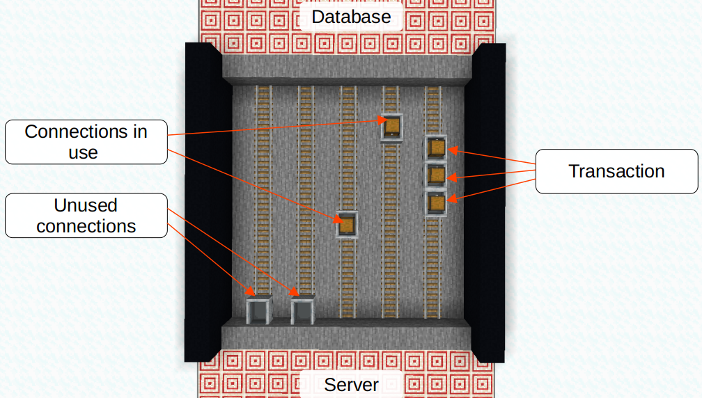

# the problem

Connection Pooling is an often overlooked concept when it comes to databases. An inexperienced developer might implement an API backend like this:

1. HTTP Request comes in
2. Open connection to the database
3. Execute SQL command and read response
4. Close connection to the database (also often forgotten)
5. Send HTTP response

Opening and closing a connection (step 2 & 4) produces load on the database server instance. Beside the number of parallel open connections is limited. That way forgetting to close connections might even make the database unavailable in the long run. Connection pooling solves these issues by keeping a sufficient number of durable connections to the database open.

# the metaphor

 <figure>
  
</figure> 

Metaphor: Between Server and Database exists a tunnel, called network link. In the tunnel is a single track of rails, known as connection. As said, reusing the rails is easier than building new ones everytime. The track of rails carries a single wagon. The wagon transports a SQL command from the Server to the Database and returns the execution result (e.g. selected rows) back. If the wagon is in transit the railway is blocked. No other wagon can use the railway at the same time. Therefore, the tunnel doesn't contain a single railway but a pool of railways. To execute a SQL statement you just need to acquire a free wagon. When the wagon returned from the Database with the SQL response the wagon is put back (into the pool). Now it is usable for another SQL statement. If all wagons are in transit, you need to enlarge the tunnel and add an addition railway (increase pool size).

Metaphor goes on: Transactions contain multiple SQL commands. Meaning, a transaction is a chain of wagons. Instead of a single wagon a whole train is on the railway. When it arrives at the Database, it gets processed wagon by wagon (SQL statement by statement). If there is a problem with a wagon the previous wagons are discarded and the whole train is sent back (transaction rollback). But if all wagons are processed successfully the train will return all wagons filled with their results (transaction commit). As a transaction is a train of wagons it is always handled on a single railway. That's why SQL transactions are connection bound.

# the realization

In practice a connection pool has the following parameter:

* **<abbr title="Data Source Name">dsn</abbr>**: Connection parameter (host, port, user, password, dbname, encryption)
* **min_pool_size**: the minimum number of opened, parallel connections in the connection pool (e.g. 5)
* **max_pool_size**: the maximum number of opened, parallel connections in the connection pool (e.g. 25)

It's highly recommendable to set a *max_pool_size* for safety reasons. Otherwise, accidental long-running SQL statements might block all connection capacities of the database. In this situation the connection pooler will open up more and more connections until the database can't handle anymore. Now the problem is the same as described above. With a *max_pool_size* set, the application will crash before with an error message like "connection pool exhausted".

A good implementation might work as follows:

1. The Server is starting.
2. The connection pooler opens the *min_pool_size* number of connections to the Database.
3. When the pooler is done the Server is ready to accept requests.
4. When an HTTP request comes in a connection is acquired from the connection pool.
5. The SQL statement gets executed.
6. Afterwards the connection is put back into the connection pool.
7. The HTTP request gets a response.

Most modern database drivers should include a connection pooling mechanism. Otherwise, there are separate tools like PgBouncer to get the job done.
