This post will briefly explain the basic components of a geographic information system (GIS) from a technical point of view (for comp sci students).

# Part 1

 <figure>
  
</figure> 

* **GIS**: provides the required tools to perform operations on geospatial data, e.g. QGIS, OpenLayers, Google Maps

* **Map**: representation of geospatial information, shows multiple layers which are stacked over each other in a visual manner

* **Projection**: transformation of the earth shape into a rectangle (2d) or sphere (3d). This process is never lossless, see https://www.thetruesize.com/. Projections can cover only parts of the earth or the whole globe (world projections). World projections are EPSG:3857 and EPSG:4236 (longitude+latitude)

* **Layer**: contains geographical information for a specific topic, e.g. buildings, roads or rails. 

* **Raster Layer**: Shows georeferenced pixel-based photos, e.g. satellite photo, air photo or street map (like [OpenStreetMap](https://www.openstreetmap.org/about))

* **Vector Layer**: Shows georeferenced, scalable and interactive geometric shapes 

* **Feature**: a technical unit represented on a map, e.g. a tree, a rail track, a building, a sea.

* **Tabular feature data**: key value information about the feature, e.g. address of a building

* **Geometry attribute of a feature**: where and in which shape the feature is located on the map

* **Geometry**: a georeferenced shape

* **Point**: single pair of coordinates: `(x,y)`

* **LineString**: list of coordinates: `[(x1,y1), (x2,y2), (x3,y3)]`

* **Polygon**: list of coordinates with first and last point connected: `[(x1,y1), (x2,y2), (x3,y3), (x1,y1)]`

* **Circle**: can either be constructed from a list of coordinates (as polygon, imprecise) or based on a centre and radius

* **Multi Point, LineString, Polygon**: a feature consisting of multiple non-connected geometries might have a composed type.

* **Style**: how to present a feature on the map. Different styles allow a graphical analysis of the features. Therefore, varying styling rules can be built out of the *Tabular feature data*.

# Part 2

 <figure>
  
</figure> 

* **Service**: Processes the geodata into a consumable format, e.g. render a raster image. Operates as web server.

* **GeoJSON**: JSON based exchange format for *Geometries* and *Tabular feature data*

* **PostGIS**: A postgres server instance with the "PostGIS" extension installed

* **GeoPackage**: SQLite based geodata store

* **WMS**: open standard protocol to render raster images out of geospatial data and styling rules

* **WMTS**: same as *WMS* but pre-rendered into Tiles of a fixed size

* **WFS**: open standard protocol to query *Features* with *Geometries*, not *Styles*!

* **WFS-T**: same as *WFS* but transactional (allow editing of *Features*)